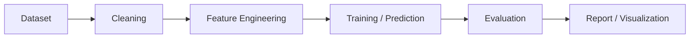

# 员工离职预测系统 Architecture

## 系统边界

该项目记录为数据分析和预测原型。除非后续补充证据，不声明生产部署、真实企业应用或具体准确率。

## 模块划分

- 数据输入模块：待补充。
- 数据清洗模块：待补充。
- 特征处理模块：待补充。
- 模型训练模块：待补充。
- 模型评估模块：待补充。
- 结果展示模块：待补充。

## 数据流

## 技术选型

待补充。

## 核心设计

待补充。

## 安全边界

- 不保存真实员工隐私数据。
- 不提交企业内部数据集。
- 不伪造模型准确率或生产部署效果。

## 架构限制

待补充。

## 后续演进方向

- 补充数据来源说明。
- 补充模型和指标。
- 补充可复现实验记录。
