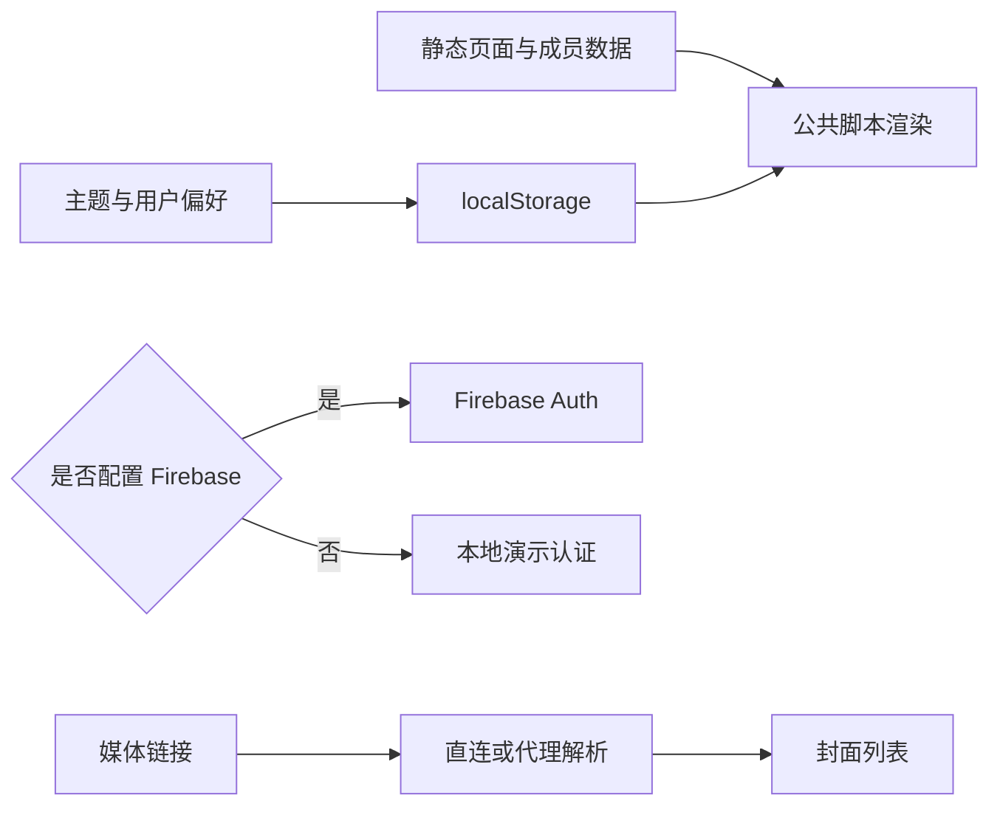

# KMNZ Architecture

## 系统边界

KMNZ 是纯静态前端站点。成员和页面内容随仓库发布，用户偏好和演示账户保存在浏览器本地；只有配置 Firebase 或封面代理时才依赖外部服务。

## 页面结构

```text
KMNZ/
├── index.html
├── members.html
├── member1.html ... member4.html
├── history.html
├── about.html
├── auth.html
├── reset.html
├── user.html
├── songcover.html
├── css/style.css
├── js/
└── assets/
```

## 模块划分

- `config.js`：Firebase 和封面代理配置入口；
- `data.js`：成员数据；
- `main.js`：导航、轮播、认证和公共交互；
- `theme.js`：主题初始化、切换和持久化；
- `profile.js`：个人中心交互；
- `songcover.js`：封面解析、保存和删除。

## 数据流



## 主题设计

主题模块优先读取 localStorage，没有保存值时参考系统配色。模块更新根元素属性、浏览器主题色和按钮状态，使各页面共享一致主题。

## 认证边界

Firebase 配置存在时使用 Firebase Auth；否则回退到 localStorage 演示账户。回退模式不提供生产级密码安全、服务端会话或跨设备同步。

## 架构限制

- 页面脚本通过全局 `window` 对象共享状态；
- 多页面 HTML 存在重复结构；
- 外部封面解析受 CORS 和第三方页面变化影响；
- 没有依赖管理、打包、测试和 CI。

## 后续演进

- 抽取共享页面布局；
- 将本地认证明确限制为演示模式；
- 增加 Playwright 页面与主题测试；
- 增加链接检查和静态站点 CI；
- 配置稳定的静态站点部署。
