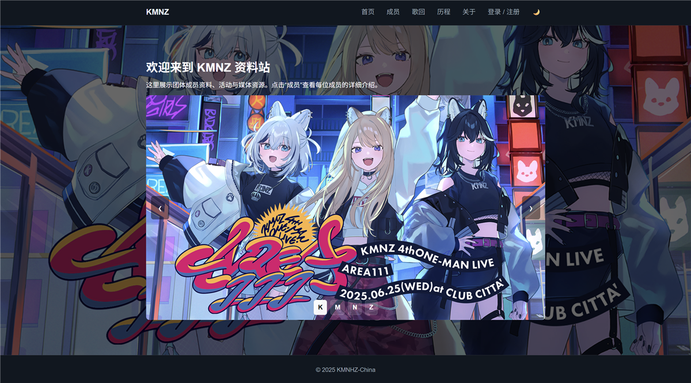

# KMNZ 资料站

## 项目背景

KMNZ 是一个使用原生 Web 技术构建的多页面资料站，用于集中展示成员资料、团队历程、媒体内容和用户页面原型。

项目无需前端构建工具，可以直接打开 HTML 或通过静态服务器运行。

## 当前状态

- GitHub 默认分支最新提交：`480d796`；
- 公开仓库包含 12 个 HTML 页面、全站样式、JavaScript 模块和图片资源；
- 本轮全部 JavaScript 文件通过 `node --check`；
- 本轮全部本地 HTML 链接检查通过；
- 没有自动化浏览器测试、CI 或已确认的公开部署地址。

## 技术栈

- HTML5
- CSS3
- 原生 JavaScript
- localStorage
- Firebase Auth（可选配置）
- 静态资源与响应式布局

## 主要功能

- 首页主视觉和内容轮播；
- 成员列表和四个成员详情页；
- 团队历程与关于页面；
- 浅色/深色主题切换并持久化；
- 登录、注册、重置密码和个人中心原型；
- 可选 Firebase Auth，未配置时使用 localStorage 演示模式；
- 歌回封面链接导入、本地保存和删除；
- 基础 SEO、Open Graph 和无障碍属性。

## 技术要点

- 通过共享脚本动态补充导航、主题按钮和成员卡片；
- 主题模块在页面渲染前读取本地偏好，减少主题闪烁；
- 认证模块按配置决定使用 Firebase 或本地演示逻辑；
- 歌回封面模块支持代理地址配置，用于处理第三方请求的跨域限制；
- 页面在没有打包工具的情况下共享统一 CSS 和 JavaScript。

## 验证情况

- 42 个 Git 跟踪文件已核对；
- JavaScript 语法检查通过；
- HTML 本地链接检查通过；
- 首页预览图已人工检查；
- 未执行浏览器端交互自动化测试。

## 已知限制

- localStorage 认证只是演示模式，会在浏览器中保存用户信息，不适合真实账户；
- Firebase 和封面代理需要单独配置；
- 第三方链接可能受跨域、接口变化或网络环境影响；
- 多页面结构存在重复导航和脚本引用；
- 缺少模块化构建、自动化测试和 CI；
- 项目素材用于非商业作品展示。

## 源码地址

[github.com/vanyiung/KMNZ](https://github.com/vanyiung/KMNZ)

## 演示地址

暂无已确认的公开演示地址。
