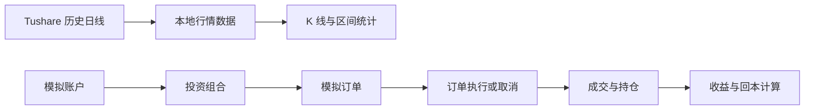

# QuantGuard Architecture

## 系统边界

QuantGuard v1.0.0 是本地模拟交易与历史行情分析系统。它不连接真实券商、不自动操作真实账户、不提供实时行情，也不执行真实交易。

## 仓库结构

```text
QuantGuard/
├── .github/workflows/
├── quant-guard-backend/
└── quant-guard-frontend/
```

## 后端分层

- `controller`：REST API 入口；
- `service`：业务流程和事务编排；
- `mapper`：MyBatis-Plus 数据访问；
- `entity`：数据库实体；
- `dto`：请求与响应模型；
- `marketdata`：行情提供方、代码解析和同步逻辑；
- `exception`：业务异常和统一错误响应。

Controller 不直接调用 Mapper，请求 DTO 与 Entity 分离。

## 前端结构

- `api`：Axios 请求层；
- `stores`：Pinia 当前账户和投资组合状态；
- `views`：模拟账户、行情中心、模拟订单、回本计算和设置；
- `components`：K 线和回本计算等可复用界面；
- `utils`：纯计算逻辑；
- `e2e`：Playwright 浏览器自动化测试。

## 核心数据流



## 核心设计

### 交易一致性

- 金额和价格使用 `BigDecimal`；
- 订单、现金、成交和持仓变化在事务边界内完成；
- 并发更新检查受影响行数或乐观锁；
- 异常时回滚相关状态。

### 资源生命周期

- 停用：保留历史和业务引用，但禁止继续用于新业务；
- 清空行情：只删除可重新生成的历史日线；
- 永久删除：仅允许删除未被业务使用的资源；
- 硬删除账户：明确提示后删除其本地模拟数据；
- 前端在删除后同步清理 Pinia 和 localStorage 选择状态。

### 行情与图表

- 历史日线通过行情提供方同步到本地数据库；
- K 线统计基于当前可视范围计算；
- 缩放、拖动和预设区间共用同一可视范围状态；
- 历史收盘价只用于模拟分析。

## 自动化验证

- 后端使用 JUnit 5、Mockito、MockMvc 和 Testcontainers；
- 前端使用 TypeScript、ESLint、Vite build 和 Playwright；
- GitHub Actions 分别验证后端和前端；
- Playwright 覆盖 K 线范围变化、账户切换、硬删除和回本计算。

## 安全边界

- Token 不写入源码或提交历史；
- `.env`、本地数据库密码和构建产物不进入 Git；
- 前端不展示后端地址等开发信息；
- GitHub Release 发布前检查工作区、敏感信息和 CI。

## 后续演进

下一阶段计划开发桌面客户端。桌面化需要处理前端壳、后端自动启停、嵌入式数据库、Token 安全存储和 Windows 安装包。
