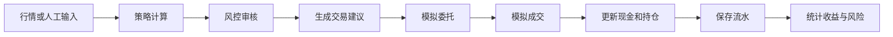

# QuantGuard Architecture

## 系统边界

QuantGuard V1 后端只处理本地模拟交易、策略辅助和风控验证，不连接真实券商、不自动操作真实账户、不接入实盘交易。

## 模块划分

- `common`：统一响应。
- `exception`：业务异常和全局异常处理。
- `controller`：REST API 入口。
- `service`：业务流程编排。
- `mapper`：MyBatis-Plus 数据访问。
- `entity`：数据库实体。
- `dto`：请求和响应对象。
- `config`：MyBatis-Plus 等基础配置。

## 数据流

## 技术选型

- Spring Boot 提供 Web API 和依赖管理。
- MyBatis-Plus 负责数据访问和乐观锁。
- MySQL 保存账户、组合、标的、持仓、订单、成交和资金流水。
- JUnit 5、Mockito、MockMvc 覆盖服务和接口行为。
- Testcontainers MySQL 验证真实数据库事务回滚。

## 核心设计

- 策略不能直接修改数据库或下单。
- 所有交易必须经过风控审核。
- 资金和持仓变化放在事务边界内。
- 订单金额、冻结金额和成交金额遵循统一精度规则。
- 并发更新依赖乐观锁和受影响行数检查。

## 安全边界

- 不保存真实券商凭据。
- 不提交本地数据库密码。
- 不处理真实交易账户。
- CI 不连接用户本机 MySQL。

## 架构限制

- 当前没有前端。
- 当前没有真实行情。
- 当前不做真实撮合系统。
- 当前不支持多用户权限。

## 后续演进方向

- V6 持续完善交易闭环。
- 增加前端页面和图表。
- 增加回测模块。
- 增加动态定投和短期止盈止损策略。
