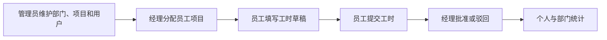
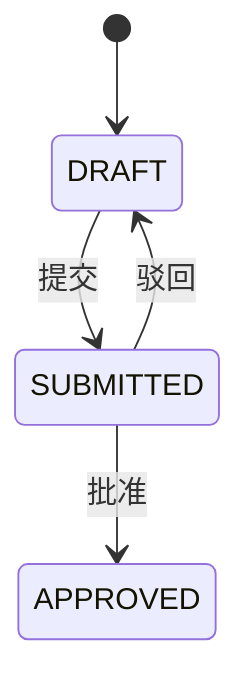

# 员工工时系统 Architecture

## 系统边界

系统面向单组织工时管理原型，覆盖管理员、经理和员工三个角色。它不代表真实企业生产系统，不声明真实用户规模或上线状态。

## 前后端结构

```text
timesheet-system/
├── timesheet-backend/     # Spring Boot / MyBatis / MySQL
└── timesheet-frontend/    # Vue 3 / TypeScript / Vite
```

后端采用 Controller、Service、Mapper、Entity、DTO 和 VO 分层；前端按 API、Pinia store、路由、布局和角色页面组织。

## 角色流程



## 工时状态



只有草稿允许修改或删除。审批操作写入 `approval_record`，统计只计算已批准工时。

## 数据设计

- 部门与用户、项目为一对多；
- 员工与项目通过 `employee_project` 建立分配关系；
- 用户、项目和日期共同约束工时记录；
- 工时与审批记录形成一对多关系；
- 基础业务表通过逻辑删除字段保留记录状态。

## 安全边界

现有登录返回 mock token，前端把用户状态保存到 localStorage。后端尚未配置 Spring Security 或统一鉴权过滤器，因此只能作为功能原型，不能直接用于真实员工数据。

## 架构限制

- Java 26 和 Spring Boot 4.0.0 提高了本地工具链要求；
- SQL 主要通过 Mapper 注解维护；
- 缺少数据库迁移工具；
- 缺少完整单元、集成和浏览器测试；
- 前端未做路由级权限守卫和代码拆分。

## 后续演进

- 使用密码哈希、JWT 或服务端会话替换 mock token；
- 在服务端统一实施角色授权；
- 增加 Flyway、后端业务测试和前端浏览器测试；
- 修复 npm 高危依赖并拆分前端主包；
- 建立前后端 CI。
