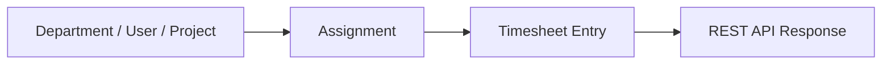

# 员工工时系统 Architecture

## 系统边界

该系统记录为工时管理类业务系统，不声明真实生产上线、真实企业使用或具体用户规模，除非后续补充证据。

## 模块划分

- 部门模块。
- 用户模块。
- 项目模块。
- 员工项目分配模块。
- 工时填报模块。
- REST API 层。

## 数据流

## 技术选型

- Spring Boot 用于构建后端接口。
- MyBatis 用于数据库访问。
- MySQL 用于保存业务数据。

## 核心设计

待补充。

## 安全边界

- 不保存真实员工隐私数据。
- 不提交真实企业数据。
- 不写未经确认的上线状态。

## 架构限制

- 权限、审批、统计和前端情况待补充。

## 后续演进方向

- 补充真实模块边界。
- 补充接口截图或 API 文档。
- 补充测试方式。
