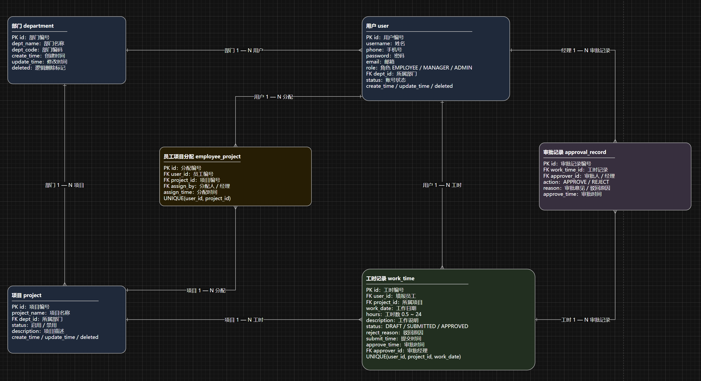

# 员工工时系统

## 项目背景

员工工时系统是面向内部团队的全栈功能原型，用于连接员工填报、经理审批、项目分配和管理端基础数据维护。

当前材料来自 2026-07-19 的本地源码备份。作品集只保存总结和脱敏 ER 图，不保存源码压缩包、数据库备份或本地配置。

## 当前状态

- Spring Boot 与 Vue 3 前后端源码完整；
- 管理员、经理、员工三类页面流程已实现；
- 前端于 2026-07-26 完成依赖安装并通过生产构建；
- 后端仅有 Spring 上下文基础测试，当前环境缺少 Maven 且默认 JDK 21 低于项目声明的 Java 26，未完成真实测试；
- 当前属于学习与演示原型，没有生产部署证据。

## 技术栈

### 后端

- Java 26
- Spring Boot 4.0.0
- MyBatis 4.0.0
- MySQL
- Maven

### 前端

- Vue 3
- TypeScript
- Vite
- Pinia
- Vue Router
- Axios
- Element Plus
- ECharts

## 主要功能

- 管理员维护部门、项目和用户；
- 经理分配员工项目；
- 员工创建、修改、删除草稿工时并单条或批量提交；
- 经理单条或批量批准、驳回工时；
- 查看个人工时统计、部门统计和部门工时明细；
- 通过不同角色工作台组织页面和操作。

## 数据模型

核心表包括：

- `department`
- `sys_user`
- `project`
- `employee_project`
- `work_time`
- `approval_record`

## 验证结果

- 前端 `npm ci`：通过；
- 前端 `npm run build`：通过；
- JavaScript/TypeScript 由 `vue-tsc` 与 Vite 构建验证；
- npm 依赖审计：发现 4 个高危依赖问题；
- 后端测试：未执行成功，原因是当前环境没有 Maven，且 JDK 版本不满足项目声明。

## 已知限制

- 登录使用原型级 mock token，密码比较和权限控制不符合生产安全要求；
- 尚未接入 Spring Security、JWT 或服务端统一授权；
- 本地配置包含数据库连接信息，不适合直接公开；
- 前端主包体积较大，构建存在拆包提醒；
- 缺少完整后端测试、前端自动化测试和 CI；
- 未公开源码，未部署到生产环境。

## 源码地址

未公开。源码目前保存在本地项目备份中。

## 演示地址

暂无公开演示地址。
