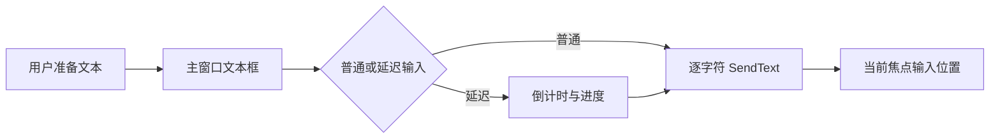

# TypeWriter Architecture

## 系统边界

TypeWriter 是单文件 Windows 桌面工具。它不连接服务器、不上传文本、不保存用户输入内容，只向当前活动窗口模拟键盘输入。

## 模块划分

- 主窗口：文本输入和编辑按钮；
- 输入控制：普通输入、延迟输入和逐字符发送；
- 快捷键：注册、更新和错误恢复；
- 设置窗口：快捷键、延迟和输入速度；
- 系统集成：托盘、始终置顶、开机自启；
- 布局辅助：子窗口居中和多显示器边界处理。

## 数据流

## 状态存储

- 运行时变量保存快捷键、延迟时间和输入速度；
- `typewriter.ini` 保存始终置顶偏好；
- `HKCU\Software\Microsoft\Windows\CurrentVersion\Run` 保存开机自启配置。

## 安全边界

工具本身不访问网络，但会向当前活动窗口发送文本。使用者必须在触发前确认输入焦点和目标内容，避免把敏感文本写入错误窗口。

## 架构限制

- 所有逻辑集中在一个 `.ahk` 文件；
- 没有输入取消、暂停或发送前目标窗口锁定；
- 配置持久化不完整；
- 没有自动化测试和构建发布流程。

## 后续演进

- 持久化全部设置；
- 增加倒计时取消和发送中止；
- 允许绑定目标窗口并在焦点变化时停止；
- 增加 AutoHotkey 语法检查、自动构建和校验和发布。
