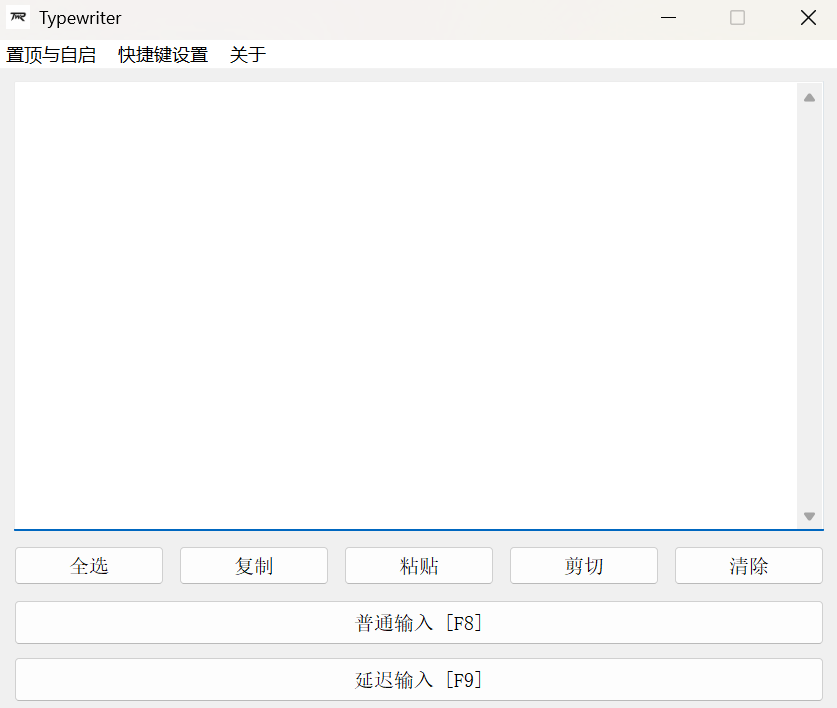

# TypeWriter

## 项目背景

TypeWriter 是一个 Windows 桌面工具，用于在网页或应用禁止粘贴时，将准备好的文本以模拟键盘输入的方式逐字符写入当前焦点位置。

项目使用 AutoHotkey v2 编写，源码和 Windows 可执行程序已公开。

## 当前状态

- 源码版本：`v1.0.0`；
- GitHub 默认分支最新提交：`bd5a791`；
- 仓库提供 `.ahk` 源码、图标和 `.exe`；
- 采用 MIT License；
- 没有自动化测试、数字签名或 GitHub Release 记录。

## 技术栈

- AutoHotkey v2
- Windows GUI
- 全局快捷键
- Windows 注册表
- INI 配置

## 主要功能

- 多行文本编辑；
- 全选、复制、粘贴、剪切和清空；
- 普通输入与延迟输入；
- 自定义普通/延迟输入快捷键；
- 自定义延迟时间和逐字符输入速度；
- 延迟进度反馈；
- 窗口始终置顶；
- 开机自启；
- 系统托盘菜单；
- 子窗口居中和多显示器工作区边界处理。

## 技术要点

- 使用 `SendText` 逐字符输出，避免依赖目标输入框的粘贴能力；
- 运行时重新注册全局快捷键，并在配置无效时恢复原快捷键；
- 使用 HKCU 注册表项控制当前用户开机自启；
- 使用 INI 文件持久化始终置顶偏好；
- 根据主窗口所在显示器计算设置窗口和关于窗口的位置。

## 验证情况

本轮通过 GitHub API 核对公开仓库、MIT License、源码和可执行程序，并静态检查 AutoHotkey 源码功能。当前环境未安装 AutoHotkey，因此没有重新运行脚本或可执行程序，也没有宣称运行测试通过。

## 已知限制

- 仅支持 Windows；
- 输入依赖目标窗口焦点，切换窗口可能把文本发到错误位置；
- 长文本输入速度受逐字符延迟影响；
- 快捷键、延迟和速度修改当前只在运行期生效；
- 可执行文件没有自动构建、签名和发布流水线；
- 不适合绕过安全控制或违反目标平台规则。

## 源码地址

[github.com/vanyiung/TypeWriter](https://github.com/vanyiung/TypeWriter)

## 演示地址

桌面工具，无 Web 演示地址。
