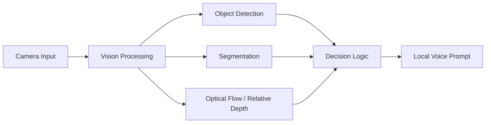

# 端侧视觉辅助出行系统 Architecture

## 系统边界

系统定位为端侧视觉辅助原型，重点在本地视觉感知和提示，不记录为已量产或已商业上线。

## 模块划分

- 视觉输入模块。
- 目标检测模块。
- 语义分割模块。
- 光流分析模块。
- 相对深度模块。
- 本地语音提示模块。
- 端侧加速部署模块。

## 数据流

## 技术选型

- Raspberry Pi 5 用作端侧主控。
- Hailo-8 用于边缘 AI 加速。
- YOLOv8 用于目标检测。
- 语义分割、光流和相对深度用于增强环境理解。

## 核心设计

待补充。

## 安全边界

- 不保存未授权路人图像。
- 不提交包含个人隐私的测试视频。
- 不把目标性能写成已验证结果。

## 架构限制

- 性能指标待核验。
- 真实场景泛化能力待补充。
- 端侧部署细节待整理。

## 后续演进方向

- 补充端侧部署流程。
- 补充脱敏演示截图。
- 补充可核验的性能记录。
