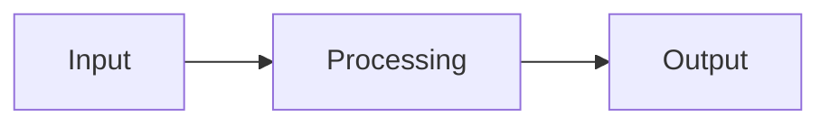

# CHANGE_ME Architecture

## 系统边界

待补充。

## 模块划分

- CHANGE_ME

## 数据流

```mermaid
flowchart LR
    A["Input"] --> B["Processing"]
    B --> C["Output"]
```

## 技术选型

- CHANGE_ME

## 核心设计

待补充。

## 安全边界

待补充。

## 架构限制

待补充。

## 后续演进方向

待补充。
